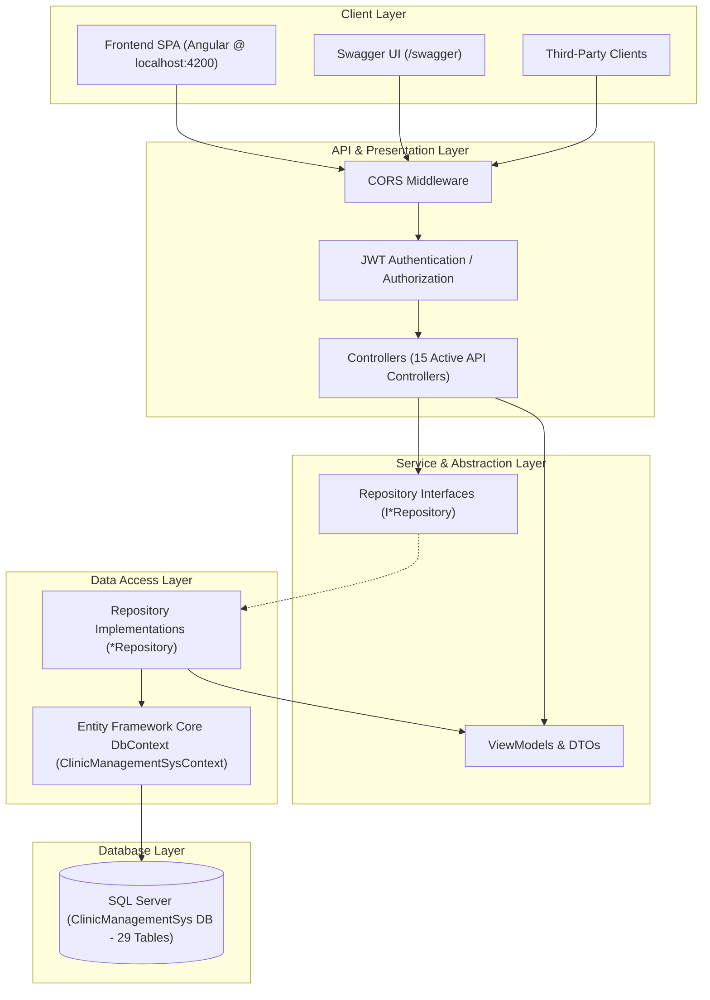
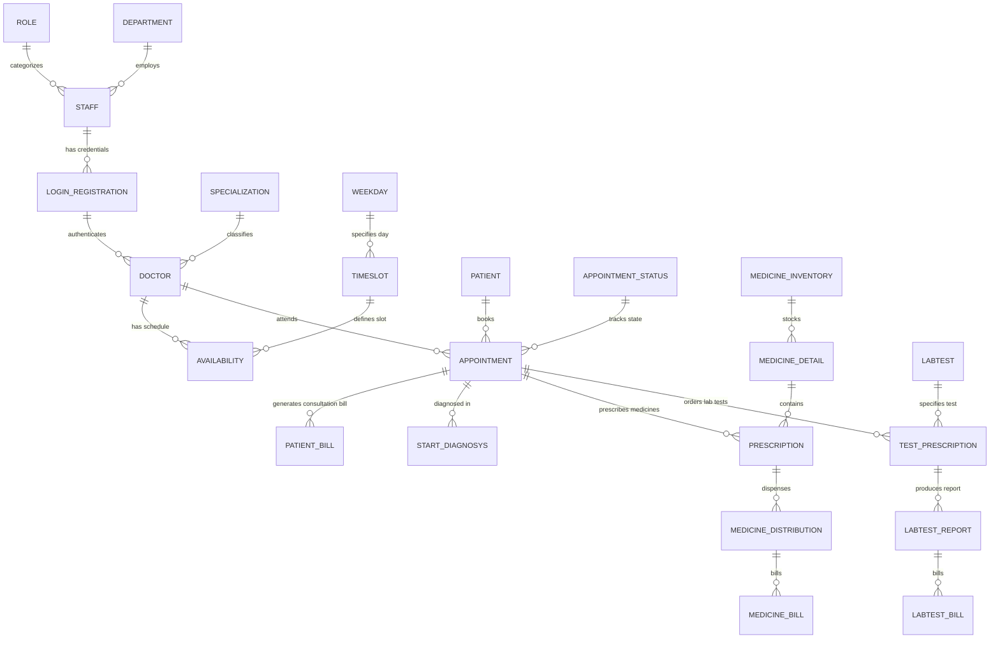

# Clinic Management System (CMS) — Backend Architecture & Module Documentation

## 1. Executive Summary

The **Clinic Management System (CMS)** backend is a RESTful enterprise Web API engineered with **ASP.NET Core (.NET 6.0)**, **Entity Framework Core 7**, and **Microsoft SQL Server**. It coordinates clinical, administrative, diagnostic, and pharmaceutical operations within a healthcare facility.

The system is designed with a **Layered N-Tier Architecture** implementing the **Repository Pattern** and **Dependency Injection (DI)**. It provides end-to-end management for patient registration, doctor scheduling, consultation workflows, laboratory investigations, pharmacy inventory, and billing.

---

## 2. Technology Stack & Infrastructure

| Layer / Concern | Technology / Library | Version | Description |
|---|---|---|---|
| **Framework & Runtime** | Microsoft .NET Core / C# | 6.0 (C# 10) | High-performance, cross-platform backend runtime |
| **API Specification** | ASP.NET Core Web API | 6.0 | RESTful controller endpoints with routing & model binding |
| **Data Access / ORM** | Entity Framework Core | 7.0.7 | Object-Relational Mapping (ORM) targeting SQL Server |
| **Database Engine** | Microsoft SQL Server Express | 2019 / 2022 | Relational database (`ClinicManagementSys` schema) |
| **Authentication & AuthZ** | JWT Bearer Authentication | 6.0.0 | Stateless JSON Web Token authentication with role claims |
| **API Documentation** | Swagger / OpenAPI (Swashbuckle) | 6.5.0 | Interactive API documentation & endpoint testing UI |
| **JSON Serialization** | System.Text.Json | Built-in | Customized serializer ignoring cycle references & preserving casing |
| **Cross-Origin Requests** | ASP.NET Core CORS | Built-in | Pre-configured for Angular SPA (`http://localhost:4200`) |

---

## 3. High-Level System Architecture

The application adopts a **Separation of Concerns (SoC)** principle structured into four distinct logical layers:



### Architectural Principles:
1. **Controller-Repository Pattern**: Controllers handle HTTP protocol specifics (routing, validation, status codes) and delegate business logic and data querying to dedicated repository classes.
2. **Dependency Injection (DI)**: Repositories are registered in the DI container with a **Scoped** lifetime (`builder.Services.AddScoped<IRepository, Repository>()`), ensuring one instance per HTTP request lifecycle.
3. **ViewModel Projection**: LINQ projections construct lightweight, specialized ViewModels (`AppPatStaLabViewModel`, `PatientBillVm`, `DoctorDetailVm`, etc.) directly from EF Core queries to eliminate excessive payload size and circular navigation references.
4. **Resilience & Cycle Handling**: `ReferenceHandler.IgnoreCycles` and `DefaultIgnoreCondition.WhenWritingNull` safeguard nested relationships during JSON serialization.

---

## 4. Entity-Relationship & Database Model

The relational database comprises **29 tables** organized around core business entities:



### Key Database Tables by Domain:

| Domain | Tables | Description |
|---|---|---|
| **Identity & Staff** | `Role`, `Department`, `Staff`, `LoginRegistration` | User credentials, roles (Doctor, Receptionist, Pharmacist, Lab Technician, Admin), departments, staff records |
| **Doctor & Scheduling** | `Specialization`, `Doctor`, `Weekdays`, `Timeslot`, `Availability`, `DailyAvailability` | Medical disciplines, doctor consultation fees, weekly schedules, availability time slots |
| **Patient & Reception** | `Patient`, `Appointment`, `AppointmentStatus`, `BillStatus`, `PatientBill` | Patient demographics, appointment tokens, status transitions (Scheduled, Completed, Cancelled), registration/consultation fee billing |
| **Consultation & Diagnosis** | `StartDiagnosys` | Doctor observations, symptoms, diagnosis notes, vital statistics |
| **Pharmacy & Medicine** | `Category`, `MedicineDetails`, `MedicineInventory`, `Prescription`, `MedDistributionStatus`, `MedicineDistribution`, `MedicineBillStatus`, `MedicineBill` | Drug catalog, stock levels, dosage prescriptions, drug distribution status, pharmacy invoice generation |
| **Laboratory & Diagnostics** | `Labtest`, `TestPrescription`, `LabTestReport`, `LabTestBillStatus`, `LabTestBill` | Test catalog (Blood, Urine, Imaging, etc.), reference ranges (high/low), sample items, test observations, lab invoicing |

---

## 5. Functional Modules Breakdown

### 5.1 Authentication & Security Module
- **Primary Controller**: `LoginsController` (`/api/Logins`)
- **Repository**: `ILoginRepository` / `LoginRepository`
- **Key Responsibilities**:
  - Validates staff credentials (`UserName` / `Password`) against `LoginRegistration`.
  - Determines associated `Role` and `Staff` identity.
  - Generates signed **JWT tokens** with claims (`ClaimTypes.Name`, `ClaimTypes.Role`).
  - Supports role-based route protection across the API.

### 5.2 Staff & Department Management Module
- **Primary Controller**: `StaffsController` (`/api/Staffs`)
- **Repository**: `IStaffRepository` / `StaffRepository`
- **Key Responsibilities**:
  - CRUD operations on clinic personnel (`Staff`).
  - Mapping staff members to clinic departments (`Cardiology`, `Pediatrics`, `Orthopedics`, etc.) and system roles.
  - Staff status activation / deactivation (`IsActive`).

### 5.3 Doctor & Scheduling Module
- **Primary Controller**: `DoctorsController` (`/api/Doctors`)
- **Repository**: `IDoctorsRepository` / `DoctorsRepository`
- **Key Responsibilities**:
  - Doctor profiles with medical registration, specialization, and consultation fees.
  - Doctor availability configuration by weekday and time slot.
  - Querying doctors by specialization, retrieving fee structures, and doctor availability calendars.

### 5.4 Patient Registration & Receptionist Desk Module
- **Primary Controllers**:
  - `RegistrationsController` (`/api/Registrations`)
  - `ReceptionsController` (`/api/Receptions`)
- **Repositories**:
  - `IRegistrationRepository` / `RegistrationRepository`
  - `IReceptionistRepository` / `ReceptionistRepository`
- **Key Responsibilities**:
  - Patient registration: Personal details, DOB, gender, blood group, contact phone, address.
  - Patient lookup by Phone Number or Patient ID.
  - Appointment scheduling with automated **Token Number** generation based on doctor and time slot.
  - Appointment status tracking (Pending, Confirmed, Completed, Cancelled).
  - Outpatient Consultation Billing (`PatientBill`) generation and receipt status.

### 5.5 Doctor Outpatient & Diagnosis Module
- **Primary Controllers**:
  - `StartDiagnosysController` (`/api/StartDiagnosys`)
  - `ViewPatientAppoinmentController` (`/api/ViewPatientAppoinment`)
- **Repositories**:
  - `IStartDiagnosysReository` / `StartDiagnosysRepository`
  - `IViewPatientAppoinmentRepository` / `ViewPatientAppoinmentRepository`
- **Key Responsibilities**:
  - Real-time appointment queue retrieval for the logged-in doctor.
  - Recording clinical findings: diagnosis, symptoms, remarks, and examination notes.
  - Updating appointment progression to Completed upon conclusion of the visit.

### 5.6 Prescription & Pharmacotherapy Module
- **Primary Controller**: `MedicinePrescriptionController` (`/api/MedicinePrescription`)
- **Repository**: `IMedicinePrescriptionRepository` / `MedicinePrescriptionRepository`
- **Key Responsibilities**:
  - Authorizing medications tied to an appointment.
  - Capturing dosage, frequency (e.g., 1-0-1), and duration (days).
  - Linking prescribed drugs with pharmacy inventory records.

### 5.7 Pharmacy & Inventory Management Module
- **Primary Controller**: `PharmacistsController` (`/api/Pharmacists`)
- **Repository**: `IPharmacistRepository` / `PharmacistRepository`
- **Key Responsibilities**:
  - Medicine inventory control: Unit pricing, quantities in stock, reorder levels, manufacturer details.
  - Processing doctor prescriptions for medicine distribution (`MedicineDistribution`).
  - Medicine billing (`MedicineBill`) calculation based on prescribed quantities and unit prices.
  - Updating distribution statuses (`Pending`, `Dispensed`).

### 5.8 Laboratory & Diagnostics Module
- **Primary Controllers**:
  - `LabsController` (`/api/Labs`)
  - `LabtestListsController` (`/api/LabtestLists`)
  - `LabtestPresciptionController` (`/api/LabtestPresciption`)
  - `NewLabtestsController` (`/api/NewLabtests`)
  - `ViewReportLabtestController` (`/api/ViewReportLabtest`)
- **Repositories**:
  - `ILabRepository` / `LabRepository`
  - `ILabtestListRepository` / `LabtestListRepository`
  - `ILabtestPrescriptionRepository` / `LabtestPrescriptionRepository`
  - `ILabTestRepositoryNew` / `LabTestRepositoryNew`
  - `IViewLabReportRepository` / `ViewLabReportRepository`
- **Key Responsibilities**:
  - Lab test master catalog (Test Name, Low Range, High Range, Unit Price).
  - Doctor test ordering (`TestPrescription`) with sample specimen specifications (Blood, Serum, Urine).
  - Daily lab test queue tracking (`today-prescribed-tests`).
  - Recording diagnostic test outcomes (`LabTestReport`) with actual numeric/textual results and pathologist remarks.
  - Diagnostic invoice generation (`LabTestBill`).

---

## 6. Comprehensive API Endpoints Catalog

| Controller | Method | Route | Description |
|---|---|---|---|
| **Logins** | `POST` | `/api/Logins` | Authenticate user credentials and return JWT bearer token |
| **Registrations** | `GET` | `/api/Registrations` | Retrieve all registered login/user accounts |
| | `POST` | `/api/Registrations` | Register new user credentials |
| **Staffs** | `GET` | `/api/Staffs` | Get all staff members |
| | `GET` | `/api/Staffs/{id}` | Get staff member by ID |
| | `POST` | `/api/Staffs` | Register a new staff profile |
| | `PUT` | `/api/Staffs/{id}` | Update existing staff details |
| **Doctors** | `GET` | `/api/Doctors` | Get all registered doctors |
| | `GET` | `/api/Doctors/specialization/{specId}` | Get doctors by medical specialization |
| | `GET` | `/api/Doctors/availability/{doctorId}` | Get schedule and time slot availability |
| | `POST` | `/api/Doctors` | Create doctor profile with fees & specialization |
| **Receptions** | `GET` | `/api/Receptions` | List all registered patients |
| | `GET` | `/api/Receptions/{id}` | Get patient details by Patient ID |
| | `GET` | `/api/Receptions/phone/{phoneNumber}` | Search patient by phone number |
| | `POST` | `/api/Receptions` | Register a new patient |
| | `POST` | `/api/Receptions/book-appointment` | Book appointment with auto-token generation |
| | `GET` | `/api/Receptions/patient-bill/{patientId}` | Generate patient consultation bill |
| **StartDiagnosys** | `GET` | `/api/StartDiagnosys` | List diagnosis records |
| | `GET` | `/api/StartDiagnosys/{id}` | Get diagnosis record by ID |
| | `GET` | `/api/StartDiagnosys/DoctorNames` | Get list of doctor names |
| | `POST` | `/api/StartDiagnosys` | Record patient diagnosis and symptoms |
| **ViewPatientAppoinment** | `GET` | `/api/ViewPatientAppoinment` | Get patient appointments list |
| | `GET` | `/api/ViewPatientAppoinment/{id}` | Get appointment details by ID |
| **MedicinePrescription** | `GET` | `/api/MedicinePrescription` | Get all medicine prescriptions |
| | `POST` | `/api/MedicinePrescription` | Add medicine prescription for an appointment |
| **Pharmacists** | `GET` | `/api/Pharmacists/inventory` | View medicine inventory and stock levels |
| | `POST` | `/api/Pharmacists/inventory` | Add/replenish medicine inventory |
| | `GET` | `/api/Pharmacists/prescriptions` | View pending prescriptions to dispense |
| | `POST` | `/api/Pharmacists/bill` | Generate pharmacy medicine bill |
| **Labs** | `GET` | `/api/Labs` | Get all lab test master records |
| | `POST` | `/api/Labs` | Create new lab test entry |
| **NewLabtests** | `GET` | `/api/NewLabtests/today-prescribed-tests` | Retrieve all tests prescribed for today's queue |
| | `GET` | `/api/NewLabtests/lab-test-details/{id}` | Get specific lab test reference values |
| | `POST` | `/api/NewLabtests/create-report` | Save lab test report results and remarks |
| | `GET` | `/api/NewLabtests/report-details/{reportId}` | View completed report details |
| | `GET` | `/api/NewLabtests/bill-details/{reportId}` | Get billing breakdown for diagnostic report |
| **ViewReportLabtest** | `GET` | `/api/ViewReportLabtest` | View all lab test reports |

---

## 7. Configuration & Environment Details

### Configuration Settings (`appsettings.json`):
```json
{
  "Logging": {
    "LogLevel": {
      "Default": "Information",
      "Microsoft.AspNetCore": "Warning"
    }
  },
  "AllowedHosts": "*",
  "ConnectionStrings": {
    "PropelAAug24Connection": "Data Source=.\\SQLEXPRESS;Initial Catalog=ClinicManagementSys;Integrated Security=True;Trusted_Connection=True;TrustServerCertificate=True"
  },
  "Jwt": {
    "Key": "ThisIsASecretKeyWithAtleast32Characters!",
    "Issuer": "faith.com"
  }
}
```

### Application URLs:
- **HTTP**: `http://localhost:5124`
- **HTTPS**: `https://localhost:7201`
- **Swagger Documentation UI**: `http://localhost:5124/swagger/index.html`

---

## 8. Defect Resolution & Refactoring Applied

To enable clean compilation and execution from the codebase, the following issues were resolved:

1. **Mal-formatted Project File (`ClinicManagementSys.csproj`)**:
   - *Issue*: Duplicate `<Project>` root tags and duplicate `<PropertyGroup>` / `<ItemGroup>` entries caused `MSB4025: There are multiple root elements`.
   - *Fix*: Cleaned the `.csproj` file to a single valid XML structure with proper package references.

2. **Dangling Braces in `LabtestPrescriptionsController.cs`**:
   - *Issue*: File had its entire body commented out except for orphaned closing braces on lines 55-56, causing `CS1022: Type or namespace definition, or end-of-file expected`.
   - *Fix*: Commented out the orphaned closing braces; endpoint functionality is actively served by `LabtestPresciptionController` and `NewLabtestsController`.

3. **Unfinished Broken Stub in `LabTestRepository.cs`**:
   - *Issue*: Orphaned statements and missing context references caused `CS1519`, `CS8803`, and `CS0106`.
   - *Fix*: Safely commented out the unused stub file; active functionality is handled by `LabTestRepositoryNew.cs` (`ILabTestRepositoryNew`).

4. **Duplicate Member Declarations in `StartDiagnosysController.cs`**:
   - *Issue*: 5 duplicate copies of `GetDoctorNames()` on lines 82-154 resulted in `CS0111: Type already defines a member called 'GetDoctorNames'`.
   - *Fix*: Removed redundant duplicate method declarations.

5. **Accidental Code Paste in `ReceptionistRepository.cs`**:
   - *Issue*: In `GetDoctorAvailabilityByDoctorIdAndDate()`, an unrelated query referencing undefined `specializationId` was pasted inside, causing `CS0103` and `CS0029`.
   - *Fix*: Replaced the malformed snippet with the correct return statement (`return availability;`).

6. **Local Database Connection String (`appsettings.json` & `appsettings.Development.json`)**:
   - *Issue*: Connection string pointed to hardcoded third-party machine names (`LAPTOP-1D8H5N1A\SQLEXPRESS` and `LAPTOP-PHHSIL6K\SQLEXPRESS`).
   - *Fix*: Updated to `Data Source=.\SQLEXPRESS;Initial Catalog=ClinicManagementSys;...` targeting the local SQL Server instance.

---

## 9. How to Build, Run & Verify

### Build the Solution:
```powershell
dotnet build "d:\ClinicManagementSys-Soln-master\ClinicManagementSys-Soln-master\ClinicManagementSys\ClinicManagementSys.csproj"
```

### Run the Web API:
```powershell
dotnet run --project "d:\ClinicManagementSys-Soln-master\ClinicManagementSys-Soln-master\ClinicManagementSys\ClinicManagementSys.csproj"
```

### Access Swagger UI:
Open your browser and navigate to:
```
http://localhost:5124/swagger/index.html
```
or
```
https://localhost:7201/swagger/index.html
```

### Verify Endpoint via Terminal:
```powershell
Invoke-RestMethod -Uri "http://localhost:5124/api/Receptions"
```
