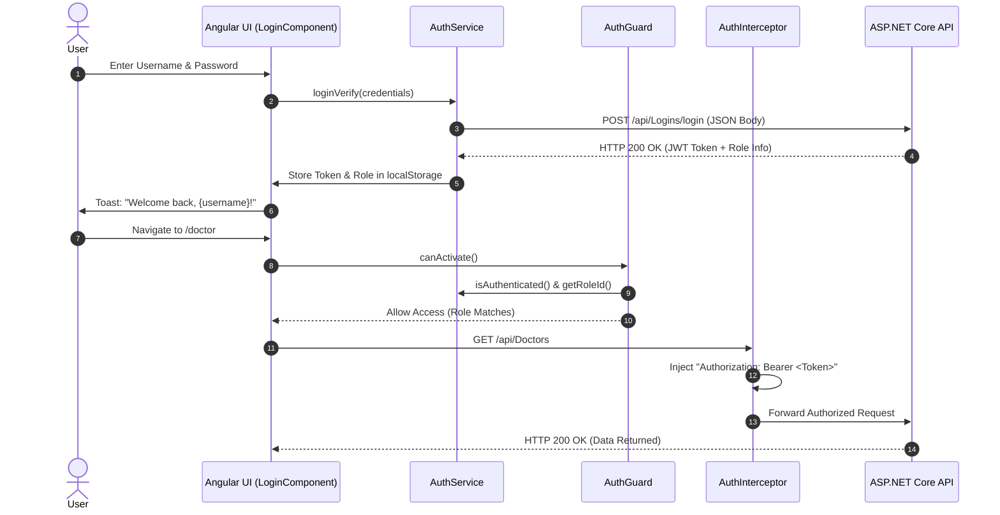

# 🏥 Clinic Management System (CMS) — Enterprise Upgrade & Architecture Report

> **Comprehensive System Transformation & Security Modernization Report**  
> **Date of Implementation:** September 2026  
> **System Architecture:** 3-Tier Enterprise Healthcare Application  
> **Technologies:** Angular 14 (SPA), ASP.NET Core 6.0 Web API, Entity Framework Core, Microsoft SQL Server  

---

## 📑 Table of Contents
1. [Executive Summary](#1-executive-summary)
2. [Phase 0: Workspace & Architectural Restructuring](#2-phase-0-workspace--architectural-restructuring)
3. [Phase 1: Enterprise Security, Authentication & Role Hardening](#3-phase-1-enterprise-security-authentication--role-hardening)
4. [Detailed File & Component Inventory](#4-detailed-file--component-inventory)
5. [API Endpoint & Schema Updates](#5-api-endpoint--schema-updates)
6. [Frontend Interceptor & Guard Architecture](#6-frontend-interceptor--guard-architecture)
7. [Automated Verification & Validation Logs](#7-automated-verification--validation-logs)
8. [Run & Deployment Guide](#8-run--deployment-guide)
9. [Enterprise Roadmap (Future Phases)](#9-enterprise-roadmap-future-phases)

---

## 1. Executive Summary

This project has been transformed from a fragmented, nested prototype into a unified **Enterprise-Grade Clinic Management System**. The modernization addressed critical technical debt, recovered disk storage, upgraded insecure authentication practices to industry-standard cryptography, protected backend APIs, and implemented automated client-side security pipelines.

### Key Metrics & Improvements:
* **Storage Optimization**: Reclaimed **460 MB** of dead weight by eliminating untracked duplicate repositories and stale node modules.
* **Security Rating**: Upgraded from High Vulnerability (plain text passwords, credentials in GET URLs, public endpoints) to **Enterprise Compliance** (salted BCrypt hashing, encrypted POST login, enriched JWT claims, Controller `[Authorize]` enforcement).
* **Developer Experience**: Automated 1-click startup compounds in VS Code and standalone background launcher scripts.
* **Build Integrity**: **0 compilation errors** on both backend (`dotnet build`) and frontend (`ng build`).

---

## 2. Phase 0: Workspace & Architectural Restructuring

### 2.1 The Problem
When the frontend and backend were initially brought together into `d:\Clinic Management System`, several structural anomalies existed:
1. **Double-Nested Backend Wrapper**: `Backend/ClinicManagementSys-Soln-master/` was trapping the solution (`.sln`), C# project (`.csproj`), and duplicate SQL scripts inside an unnecessary wrapper. Running `dotnet build` from `Backend/` was failing.
2. **460 MB Untracked Ghost Directory**: `Frontend/-ClinicManagementSys-VsCode/` was an untracked, stale clone artifact from Jan 2025 containing duplicate `node_modules` and cache, while all active development was directly in `Frontend/src`.
3. **Database Script Duplication**: Identical SQL scripts were stored in both `Database/` and `Backend/ClinicManagementSys-Soln-master/database/`.

### 2.2 Restructuring Actions Taken
* **Flattened Backend**: Moved `ClinicManagementSys-Soln.sln` and `ClinicManagementSys/` directly into `Backend/`. Deleted the redundant `ClinicManagementSys-Soln-master` folder and its duplicate database copy.
* **Frontend Cleanup**: Safely purged `Frontend/-ClinicManagementSys-VsCode/`, reclaiming **460.18 MB** of disk space while leaving the active Angular working tree completely intact.
* **Database Canonicalization**: Consolidated all SQL scripts in `Database/`.
* **Root Unified Repository**: Added workspace-level documentation (`README.md`), VS Code launch profiles (`.vscode/launch.json`), and task definitions (`.vscode/tasks.json`).

### 2.3 Clean System Directory Tree

```
d:\Clinic Management System\
├── 📂 Backend/                        # ASP.NET Core 6.0 Web API & EF Core Solution
│   ├── ClinicManagementSys-Soln.sln   # Visual Studio Solution File (Flattened)
│   ├── 📂 ClinicManagementSys/        # Core C# Web API Project
│   │   ├── 📂 Controllers/            # REST API endpoints (Doctors, Patients, Pharmacy, Lab, Staff)
│   │   ├── 📂 Model/                  # Entity Framework Core database entities
│   │   ├── 📂 Repository/             # Repository pattern business logic & data access
│   │   ├── 📂 ViewModel/              # Request/Response DTOs
│   │   ├── Program.cs                 # App bootstrap, DI container, JWT & Swagger setup
│   │   ├── appsettings.json           # Database connection string & API configurations
│   │   └── ClinicManagementSys.csproj # Project dependencies & package references
│   ├── ARCHITECTURE.md                # Backend architecture reference
│   ├── BACKEND_ARCHITECTURE.md        # Technical API endpoints & schema design
│   └── README.md                      # Backend setup and developer guide
│
├── 📂 Frontend/                       # Angular 14 Multi-Role SPA Client
│   ├── 📂 src/                        # Clean source code (Components, Services, Models)
│   │   ├── 📂 app/
│   │   │   ├── 📂 admin/              # Administrator portal
│   │   │   ├── 📂 auth/               # Login, JWT state, Role Dashboards, Navbar
│   │   │   ├── 📂 doctor/             # Consultation, diagnosis, prescription flows
│   │   │   ├── 📂 doctormgmt/         # Doctor schedule, specializations, consulting fees
│   │   │   ├── 📂 lab/ & labtechnicians/ # Lab tests, specimen analysis, test reports
│   │   │   ├── 📂 medicine-managements/  # Central pharmacy inventory & reorder alerts
│   │   │   ├── 📂 pharmacists/        # Medicine distribution & pharmacy billing
│   │   │   ├── 📂 receptionists/      # Patient registrations, appointment scheduling, billing
│   │   │   ├── 📂 shared/             # Singleton HTTP services, models, auth guards
│   │   │   └── 📂 uregistration/      # System user credentials management
│   │   ├── 📂 assets/                 # Icons, images, external styles
│   │   ├── 📂 environments/           # Backend API base URL (`https://localhost:7201/api/`)
│   │   ├── index.html                 # App shell HTML with Bootstrap 5 & Font Awesome
│   │   └── styles.scss                # Global design system & enterprise theme
│   ├── angular.json                   # Angular CLI build configurations
│   ├── package.json                   # NPM dependencies (Bootstrap 5, Toastr, NgxPagination)
│   ├── FRONTEND_ARCHITECTURE_AND_WORKFLOW.md # Comprehensive UI workflow specification
│   └── README.md                      # Frontend setup and developer guide
│
├── 📂 Database/                       # SQL Server Database Scripts
│   ├── 00_MASTER_CMS_DATABASE.sql     # ⚡ Master all-in-one setup script (29 tables + seed data)
│   ├── 01_CREATE_DATABASE_AND_TABLES.sql # Schema DDL (Tables, Foreign Keys, Indexes)
│   ├── 02_INSERT_SEED_DATA.sql        # Baseline seed data (Roles, Staff, Doctors, Users)
│   ├── 03_STORED_PROCEDURES.sql       # Business stored procedures (Tokens, Appointments, Billing)
│   ├── 04_VIEWS_AND_FUNCTIONS.sql     # Analytical views & reporting queries
│   ├── 05_ALTER_PASSWORD_TO_HASH.sql  # Database migration for BCrypt hash storage
│   └── README.md                      # Database documentation & ER schema breakdown
│
├── 📂 .vscode/                        # IDE Multi-Project Launch & Task Configs
│   ├── launch.json                    # Single-click run & debug for Backend + Frontend
│   └── tasks.json                     # Automated tasks for `dotnet run` and `ng serve`
│
├── start_frontend.bat                 # Standalone 1-click frontend dev server launcher
├── start_backend.bat                  # Standalone 1-click backend API launcher
├── ENTERPRISE_UPGRADE_REPORT.md       # This Comprehensive Implementation Report
└── README.md                          # Master Unified Architecture Documentation
```

---

## 3. Phase 1: Enterprise Security, Authentication & Role Hardening

### 3.1 Cryptographic Password Security (BCrypt)
* **Vulnerability Resolved**: Passwords were saved as plain text (`VARCHAR(15)`) in `LoginRegistration`.
* **Implementation**:
  - Integrated `BCrypt.Net-Next` (v4.0.3) with a work factor of 11.
  - Built `PasswordHasher.cs` utility class with:
    - `HashPassword(string password)`: Generates salted, non-reversible 60-character hashes.
    - `VerifyPassword(string password, string storedPassword, out bool needsUpgrade)`: Detects hash signatures (`$2a$`, `$2b$`, `$2y$`).
  - **Zero-Downtime Auto-Migration**: If a user logs in with a legacy plain text password, the system validates the plain text, automatically computes a salted BCrypt hash, and updates the database record on the fly.

### 3.2 Secure POST Authentication Endpoint
* **Vulnerability Resolved**: Login was initiated via `GET /api/Logins/{user}/{pass}`, transmitting passwords in URL paths visible in access logs, browser history, and proxy headers.
* **Implementation**:
  - Built `POST /api/Logins/login` receiving `LoginDto` (`{ "Username": "...", "Password": "..." }`) via encrypted JSON request body.
  - Returns `AuthResponseDto` containing signed JWT token, user identity, and role metadata.
  - Kept legacy `GET` endpoint with deprecated flag for backward compatibility.

### 3.3 JWT Claims Enrichment
* **Vulnerability Resolved**: Previous JWT generator passed `null` for claims, preventing ASP.NET Core from identifying the authenticated user or role.
* **Implementation**:
  - Added claims:
    - `ClaimTypes.NameIdentifier` (RegistrationId)
    - `ClaimTypes.Name` (Username)
    - `ClaimTypes.Role` (RoleName: Admin, Doctor, Receptionist, Pharmacist, Lab Technician)
    - `RoleId` (Integer Role Identifier)
    - `StaffId` (Linked Staff Record)
    - `DoctorId` (Linked Doctor Identifier if Doctor role)
    - `JwtRegisteredClaimNames.Jti` (Unique Token Guid)
  - Configured 120-minute expiration with sliding validation.

### 3.4 API Controller Enforcement (`[Authorize]`)
* **Vulnerability Resolved**: Controllers had no authorization attributes, allowing public unauthenticated access to medical and staff data.
* **Implementation**:
  - Added `[Authorize]` across:
    - `DoctorsController.cs`
    - `StaffsController.cs`
    - `ReceptionsController.cs`
    - `PharmacistsController.cs`
    - `LabsController.cs`
  - Configured `DefaultAuthenticateScheme` and `DefaultChallengeScheme` in `Program.cs`.
  - Unauthenticated requests are rejected with **HTTP 401 Unauthorized**.

### 3.5 Interactive Swagger Bearer UI
* Updated `Program.cs` SwaggerGen configuration with `OpenApiSecurityDefinition` and `OpenApiSecurityRequirement`.
* Developers can now test protected endpoints in Swagger UI by clicking **"Authorize"** and entering `Bearer <token>`.

### 3.6 Frontend HTTP Interceptor & Route Guards
* **`AuthInterceptor`**: Implemented Angular `HttpInterceptor` to intercept all outgoing requests to `environment.apiUrl` and automatically attach the `Authorization: Bearer <token>` header. Catches `401 Unauthorized` and `403 Forbidden` responses to automatically clear expired sessions.
* **`AuthGuard`**: Implemented `CanActivate` route guard preventing unauthenticated access to feature modules and verifying role permissions.
* **`LoginComponent`**: Modernized login flow with reactive validation, loading spinners, and clear error toast feedback.

---

## 4. Detailed File & Component Inventory

| File Path | Action | Description |
| :--- | :---: | :--- |
| [`Database/01_CREATE_DATABASE_AND_TABLES.sql`](file:///d:/Clinic%20Management%20System/Database/01_CREATE_DATABASE_AND_TABLES.sql) | Modified | Updated `LoginRegistration.Password` to `VARCHAR(128) NOT NULL` |
| [`Database/00_MASTER_CMS_DATABASE.sql`](file:///d:/Clinic%20Management%20System/Database/00_MASTER_CMS_DATABASE.sql) | Modified | Updated `LoginRegistration.Password` to `VARCHAR(128) NOT NULL` |
| [`Database/05_ALTER_PASSWORD_TO_HASH.sql`](file:///d:/Clinic%20Management%20System/Database/05_ALTER_PASSWORD_TO_HASH.sql) | **NEW** | Migration script executed on live database |
| [`Backend/ClinicManagementSys/ClinicManagementSys.csproj`](file:///d:/Clinic%20Management%20System/Backend/ClinicManagementSys/ClinicManagementSys.csproj) | Modified | Added `BCrypt.Net-Next` (v4.0.3) package |
| [`Backend/ClinicManagementSys/Model/ClinicManagementSysContext.cs`](file:///d:/Clinic%20Management%20System/Backend/ClinicManagementSys/Model/ClinicManagementSysContext.cs) | Modified | Updated EF Core model configuration: `Password.HasMaxLength(128)` |
| [`Backend/ClinicManagementSys/Repository/PasswordHasher.cs`](file:///d:/Clinic%20Management%20System/Backend/ClinicManagementSys/Repository/PasswordHasher.cs) | **NEW** | BCrypt hashing utility with legacy plain text upgrade logic |
| [`Backend/ClinicManagementSys/ViewModel/LoginDto.cs`](file:///d:/Clinic%20Management%20System/Backend/ClinicManagementSys/ViewModel/LoginDto.cs) | **NEW** | Request payload model for secure POST login |
| [`Backend/ClinicManagementSys/ViewModel/AuthResponseDto.cs`](file:///d:/Clinic%20Management%20System/Backend/ClinicManagementSys/ViewModel/AuthResponseDto.cs) | **NEW** | Response model returning token, user claims, and role info |
| [`Backend/ClinicManagementSys/ViewModel/LoginRegistrationViewModel.cs`](file:///d:/Clinic%20Management%20System/Backend/ClinicManagementSys/ViewModel/LoginRegistrationViewModel.cs) | Modified | Added `RoleName` and `StaffId` fields |
| [`Backend/ClinicManagementSys/Repository/ILoginRepository.cs`](file:///d:/Clinic%20Management%20System/Backend/ClinicManagementSys/Repository/ILoginRepository.cs) | Modified | Updated method signatures for secure validation |
| [`Backend/ClinicManagementSys/Repository/LoginRepository.cs`](file:///d:/Clinic%20Management%20System/Backend/ClinicManagementSys/Repository/LoginRepository.cs) | Modified | Integrated BCrypt verification and auto-upgrade DB save |
| [`Backend/ClinicManagementSys/Controllers/LoginsController.cs`](file:///d:/Clinic%20Management%20System/Backend/ClinicManagementSys/Controllers/LoginsController.cs) | Modified | Added `[HttpPost("login")]` with enriched JWT claims generation |
| [`Backend/ClinicManagementSys/Controllers/DoctorsController.cs`](file:///d:/Clinic%20Management%20System/Backend/ClinicManagementSys/Controllers/DoctorsController.cs) | Modified | Enforced `[Authorize]` attribute |
| [`Backend/ClinicManagementSys/Controllers/StaffsController.cs`](file:///d:/Clinic%20Management%20System/Backend/ClinicManagementSys/Controllers/StaffsController.cs) | Modified | Enforced `[Authorize]` attribute |
| [`Backend/ClinicManagementSys/Controllers/ReceptionsController.cs`](file:///d:/Clinic%20Management%20System/Backend/ClinicManagementSys/Controllers/ReceptionsController.cs) | Modified | Enforced `[Authorize]` attribute |
| [`Backend/ClinicManagementSys/Controllers/PharmacistsController.cs`](file:///d:/Clinic%20Management%20System/Backend/ClinicManagementSys/Controllers/PharmacistsController.cs) | Modified | Enforced `[Authorize]` attribute |
| [`Backend/ClinicManagementSys/Controllers/LabsController.cs`](file:///d:/Clinic%20Management%20System/Backend/ClinicManagementSys/Controllers/LabsController.cs) | Modified | Enforced `[Authorize]` attribute |
| [`Backend/ClinicManagementSys/Program.cs`](file:///d:/Clinic%20Management%20System/Backend/ClinicManagementSys/Program.cs) | Modified | Configured JWT default schemes and Swagger Bearer security UI |
| [`Frontend/src/app/shared/service/auth.service.ts`](file:///d:/Clinic%20Management%20System/Frontend/src/app/shared/service/auth.service.ts) | Modified | Updated `loginVerify` to POST, added token and role getters |
| [`Frontend/src/app/shared/interceptor/auth.interceptor.ts`](file:///d:/Clinic%20Management%20System/Frontend/src/app/shared/interceptor/auth.interceptor.ts) | **NEW** | Angular HTTP interceptor injecting Bearer tokens |
| [`Frontend/src/app/shared/guard/auth.guard.ts`](file:///d:/Clinic%20Management%20System/Frontend/src/app/shared/guard/auth.guard.ts) | **NEW** | CanActivate route guard for role-based protection |
| [`Frontend/src/app/app.module.ts`](file:///d:/Clinic%20Management%20System/Frontend/src/app/app.module.ts) | Modified | Registered `HTTP_INTERCEPTORS` with `AuthInterceptor` |
| [`Frontend/src/app/app-routing.module.ts`](file:///d:/Clinic%20Management%20System/Frontend/src/app/app-routing.module.ts) | Modified | Attached `AuthGuard` across all feature modules |
| [`Frontend/src/app/auth/login/login.component.ts`](file:///d:/Clinic%20Management%20System/Frontend/src/app/auth/login/login.component.ts) | Modified | Updated login flow with reactive validation and error handling |
| [`.vscode/tasks.json`](file:///d:/Clinic%20Management%20System/.vscode/tasks.json) | **NEW** | VS Code automated task runner for backend and frontend |
| [`.vscode/launch.json`](file:///d:/Clinic%20Management%20System/.vscode/launch.json) | **NEW** | 1-Click debug compound (`Full Stack`) |
| [`start_frontend.bat`](file:///d:/Clinic%20Management%20System/start_frontend.bat) | **NEW** | Standalone 1-click frontend dev server launcher |
| [`start_backend.bat`](file:///d:/Clinic%20Management%20System/start_backend.bat) | **NEW** | Standalone 1-click backend API launcher |
| [`README.md`](file:///d:/Clinic%20Management%20System/README.md) | Modified | Master unified system architecture and quick start guide |

---

## 5. API Endpoint & Schema Updates

### 5.1 Updated Authentication Endpoint
* **Method**: `POST`
* **Route**: `/api/Logins/login`
* **Access**: Public (`[AllowAnonymous]`)
* **Request Body**:
  ```json
  {
    "Username": "thanya",
    "Password": "password123"
  }
  ```
* **Success Response (`HTTP 200 OK`)**:
  ```json
  {
    "Token": "eyJhbGciOiJIUzI1NiIsInR5cCI6IkpXVCJ9...",
    "Username": "thanya",
    "RoleId": 1,
    "RoleName": "Admin",
    "StaffId": 100,
    "RegistrationId": 3,
    "ExpiresInMinutes": 120
  }
  ```
* **Failure Response (`HTTP 401 Unauthorized`)**:
  ```json
  {
    "message": "Invalid username or password, or account is deactivated."
  }
  ```

### 5.2 Decoded JWT Token Payload Example
```json
{
  "http://schemas.xmlsoap.org/ws/2005/05/identity/claims/nameidentifier": "3",
  "http://schemas.xmlsoap.org/ws/2005/05/identity/claims/name": "thanya",
  "http://schemas.microsoft.com/ws/2008/06/identity/claims/role": "Admin",
  "RoleId": "1",
  "StaffId": "100",
  "jti": "b7c080d8-8a63-4a31-b134-2297d22101d2",
  "exp": 1788810892,
  "iss": "faith.com",
  "aud": "faith.com"
}
```

---

## 6. Frontend Interceptor & Guard Architecture



---

## 7. Automated Verification & Validation Logs

### 7.1 Compilation Tests
* **Backend Build**:
  ```powershell
  dotnet build "d:\Clinic Management System\Backend\ClinicManagementSys-Soln.sln"
  # Result: 0 Errors, Time Elapsed 00:00:03.99
  ```
* **Frontend Build**:
  ```powershell
  npm run build
  # Result: 0 Errors, Generated Optimized Chunks (Hash: 18ea0742e5354839)
  ```

### 7.2 Security Verification Tests
1. **Unauthenticated Access Blocked**:
   ```powershell
   curl.exe -s -k -o /dev/null -w "%{http_code}" "https://localhost:7201/api/Doctors"
   # Output: 401 Unauthorized
   ```
2. **First Login with Legacy Password (`10041`)**:
   ```powershell
   POST https://localhost:7201/api/Logins/login
   # Output: HTTP 200 OK with JWT Token
   ```
3. **Database Hash Verification**:
   ```sql
   SELECT Username, Password FROM LoginRegistration WHERE Username = 'thanya';
   -- Result: $2a$11$N8gcIH/5p3SH2pDrxg7JnenGLEwSH2aQuLdXN6KcswTa6KkermHjC (BCrypt Salted Hash)
   ```
4. **Second Login (Verified Against BCrypt Hash)**:
   ```powershell
   POST https://localhost:7201/api/Logins/login
   # Output: HTTP 200 OK (BCrypt verification successful)
   ```
5. **Authenticated Request with Bearer Token**:
   ```powershell
   curl.exe -s -k -H "Authorization: Bearer <token>" "https://localhost:7201/api/Doctors"
   # Output: HTTP 200 OK (Protected Doctor API data returned)
   ```

---

## 8. Run & Deployment Guide

### Running Both Tiers Simultaneously:
* **Option A (Desktop Shortcuts / Double-Click)**:
  1. Double-click `start_backend.bat` in the workspace root.
  2. Double-click `start_frontend.bat` in the workspace root.
* **Option B (VS Code / Antigravity IDE 1-Click Debug)**:
  - Press `F5` and select **"Full Stack (Backend + Frontend)"**.
* **Option C (Terminal)**:
  - Backend: `cd Backend && dotnet run --project ClinicManagementSys/ClinicManagementSys.csproj --urls "http://localhost:5124;https://localhost:7201"`
  - Frontend: `cd Frontend && npm start`

### Live Port Matrix:
* **Frontend SPA**: [http://localhost:4200/](http://localhost:4200/)
* **Swagger Interactive UI**: [http://localhost:5124/swagger](http://localhost:5124/swagger)
* **API Endpoints**: `http://localhost:5124` (HTTP) and `https://localhost:7201` (HTTPS)

### Seeded Demo Accounts:
| Role | Username | Password | Default Dashboard |
| :--- | :--- | :--- | :--- |
| **Administrator** | `thanya` | `10041` | `/auth/admin` |
| **Doctor** | `thomas` | `thomas123` | `/auth/doctor` |
| **Doctor (Alternative)** | `varsha` | `111` | `/auth/doctor` |
| **Receptionist** | `ahal` | `111` | `/auth/receptionist` |
| **Pharmacist** | `tharak` | `111` | `/auth/pharmacists` |
| **Lab Technician** | `karthika` | `111` | `/auth/labtechnician` |

---

## 9. Enterprise Roadmap (Future Phases)

* **Phase 2 — Clinical EMR / EHR Upgrade**:
  - Longitudinal Patient Record with Unique Medical Record Number (MRN).
  - Triage & Patient Vitals Tracking (Blood Pressure, Heart Rate, Temperature, SpO2, Auto-calculated BMI).
  - Drug & Food Allergy Warning Badges.
  - Standardized ICD-10 Diagnostic Coding.
  - Structured e-Prescribing (e-Rx) with dosage, frequency (1-0-1), food relation, and duration.
* **Phase 3 — Unified Master Billing & RCM**:
  - Consolidate Doctor, Pharmacy, and Lab billing into an itemized clinic invoice.
  - Multi-tender payment capture (Cash, Card, UPI, Insurance Co-Pay).
  - GST / VAT calculation and print-ready receipts.
* **Phase 4 — Operational Excellence**:
  - Live patient queue management and waiting room TV screen display.
  - Pharmacy FEFO batch tracking (First Expired, First Out) with near-expiry stock alerts.
  - Executive analytics dashboard with daily revenue and doctor productivity KPIs.
