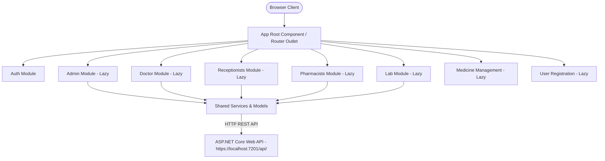
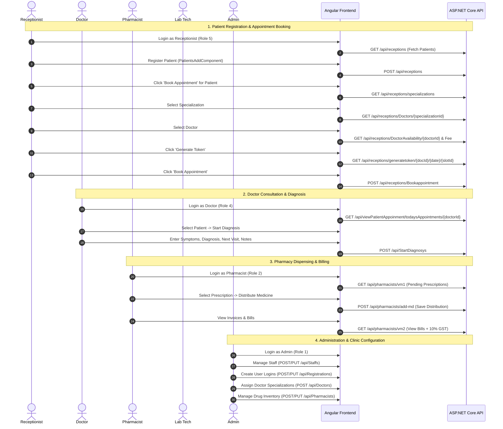

# Clinic Management System - Frontend Architecture, Module Inventory & Workflow Analysis

> **Comprehensive Analysis Report**  
> **Application:** Clinic Management System (Frontend)  
> **Framework:** Angular 14 (SPA)  
> **Backend Integration:** ASP.NET Core Web API (`https://localhost:7201/api/`)  
> **Date of Analysis:** September 2026  

---

## 1. Executive Summary & Architecture Overview

The Clinic Management System (CMS) frontend is an **Angular 14 Single-Page Application (SPA)** designed for multi-role clinic automation. It facilitates end-to-end interactions among five primary user personas: **Administrators**, **Doctors**, **Receptionists**, **Pharmacists**, and **Lab Technicians**.

### 1.1 Technical Stack
* **Core Framework:** Angular `^14.0.0` (TypeScript `^4.7.4`, RxJS `~7.5.0`, Zone.js `~0.11.4`)
* **Styling & UI Components:** Bootstrap `^5.3.3`, Font Awesome `4.7.0`, SCSS
* **Utility Libraries:** 
  * `ngx-toastr` (`^15.2.2`) for toast feedback notifications
  * `ngx-pagination` (`^5.0.0`) for client-side pagination
  * `ng2-search-filter` (`^0.5.1`) for in-memory list filtering
* **Build System:** Angular CLI (`@angular-devkit/build-angular:browser`)

### 1.2 Architectural Pattern & Design
* **Modular Structure with Feature Lazy-Loading:** Feature modules (`admin`, `doctor`, `receptionists`, `pharmacists`, `lab`, `medicine-managements`, `uregistration`) are segregated into dedicated feature directories and loaded asynchronously via Angular Route `loadChildren`.
* **Shared Layer (`src/app/shared/`):** Houses cross-cutting domain models (`shared/model/`) and singleton injectable services (`shared/service/`) decorated with `@Injectable({ providedIn: 'root' })`.
* **Central API Configuration:** The backend root endpoint is configured in `src/environments/environment.ts` (`apiUrl: 'https://localhost:7201/api/'`).
* **Session & Security Management:** 
  * **AuthInterceptor (`src/app/shared/interceptor/auth.interceptor.ts`):** Automatically injects the `Authorization: Bearer <token>` header on every HTTP request and catches 401/403 session expiration.
  * **AuthGuard (`src/app/shared/guard/auth.guard.ts`):** Protects routes from unauthenticated access and enforces role-based access control.
  * **Session Persistence:** Role ID, username, and JWT bearer tokens are persisted in browser `localStorage`.



---

## 2. Complete Module Inventory & Functional Scope

The application contains **12 Angular Modules**. Below is a detailed breakdown of each module, its components, routes, models, and current operational state.

### 2.1 Root Module (`AppModule`)
* **Path:** `src/app/app.module.ts`
* **Purpose:** Application bootstrapping, global imports (`BrowserModule`, `HttpClientModule`, `BrowserAnimationsModule`, `ToastrModule`, `ReactiveFormsModule`, `NgxPaginationModule`).
* **HTTP Providers:** Registers `HTTP_INTERCEPTORS` with `AuthInterceptor` multi-provider for automatic JWT Bearer token propagation.
* **Root Route Configuration:** `src/app/app-routing.module.ts` defines parent lazy-loaded routes with `canActivate: [AuthGuard]` protecting doctor, admin, reception, pharmacy, and lab routes.

---

### 2.2 Authentication Module (`AuthModule`)
* **Path:** `src/app/auth/auth.module.ts`
* **Routing:** `src/app/auth/auth-routing.module.ts` (Base path: `/auth`)
* **Associated Service:** `AuthService` (`src/app/shared/service/auth.service.ts`)
* **Components:**
  * `LoginComponent` (`auth/login`): Reactive form for Username & Password. Performs role inspection and routes user to their dashboard.
  * `AdmindashComponent` (`auth/admin`): Dashboard landing hub for Admin with quick links.
  * `DoctordashComponent` (`auth/doctor`): Dashboard intended to show today's appointments.
  * `ReceptionistdashComponent` (`auth/receptionist`): Receptionist portal with tiles for search, patient reg, and appointments.
  * `PharmacistdashComponent` (`auth/pharmacists`): Pharmacy dashboard with navigation to prescriptions and inventory.
  * `LabtechniciandashComponent` (`auth/labtechnician`): Lab tech dashboard for test lists.
  * `NavbarComponent`: Navigation bar intended for dashboard views.
  * `PagenotfoundComponent`: 404 fallback page.
* **Security Artifacts:**
  * `AuthGuard` (`auth.guard.ts`): Route guard intended to verify `localStorage.getItem("AccessRole")`.
  * `AuthInterceptor` (`auth.interceptor.ts`): HTTP Interceptor intended to attach `Authorization: Bearer <token>` to outgoing requests.

---

### 2.3 Administration Module (`AdminModule`)
* **Path:** `src/app/admin/admin.module.ts`
* **Routing:** `src/app/admin/admin-routing.module.ts` (Base path: `/admin`)
* **Associated Service:** `StaffService` (`src/app/shared/service/staff.service.ts`)
* **Models:** `Staff`, `Department`
* **Components:**
  * `StaffListComponent` (`/admin/list`): Displays paginated table of staff members, filterable by name/code, with edit and soft-delete actions.
  * `StaffAddComponent` (`/admin/add`): Form to register new staff with department dropdown (`Staffs/v2`).
  * `StaffEditComponent` (`/admin/edit/:id`): Form to modify staff profile and employment status.

---

### 2.4 User Registration Module (`UregistrationModule`)
* **Path:** `src/app/uregistration/uregistration.module.ts`
* **Routing:** `src/app/uregistration/uregistration-routing.module.ts` (Base path: `/uregistration`)
* **Associated Service:** `RegistrationService` (`src/app/shared/service/registration.service.ts`)
* **Models:** `Registration`, `Role`, `Staff`
* **Components:**
  * `UregistrationListComponent` (`/uregistration/list`): Master list of registered user credentials linked to staff IDs.
  * `UregistrationAddComponent` (`/uregistration/add`): Form to create login credentials, bind role IDs (`Registrations/v5`), and assign to staff (`Registrations/v2`).
  * `UregistrationEditComponent` (`/uregistration/edit/:id`): Edit existing user account details and credentials.

---

### 2.5 Doctor Management Module (`DoctormgmtModule`)
* **Path:** `src/app/doctormgmt/doctormgmt.module.ts`
* **Routing:** `src/app/doctormgmt/doctormgmt-routing.module.ts` (Base path: `/doctormgmt`)
* **Associated Service:** `DmanagementService` / `DoctormanagementService`
* **Models:** `Doctors`, `Specialization`, `Staff`, `User`
* **Components:**
  * `DoctormgmtListComponent` (`/doctormgmt/list`): Displays doctors along with their specializations, consultation fees, and active status.
  * `DoctormgmtAddComponent` (`/doctormgmt/add`): Associates a staff member with a medical specialization and consultation fee.
  * `DoctormgmtEditComponent` (`/doctormgmt/edit/:id`): Updates doctor specialization and consultation fees.

---

### 2.6 Receptionist & Patient Management Module (`ReceptionistsModule`)
* **Path:** `src/app/receptionists/receptionists.module.ts`
* **Routing:** `src/app/receptionists/receptionists-routing.module.ts` (Base path: `/patients`)
* **Associated Service:** `PatientService` (`src/app/shared/service/patient.service.ts`)
* **Models:** `Patient`, `Specialization`, `Doctors`, `Doctorbyspectn`, `Availability`, `Appointment`
* **Components:**
  * `PatientsListComponent` (`/patients/list`): Patient directory search by phone number or Patient Code (`PC...`); contains triggers for editing and appointment booking.
  * `PatientsAddComponent` (`/patients/add`): Registration form capturing Patient demographics (Name, DOB, Gender, Blood Group, Phone, Address).
  * `PatientsEditComponent` (`/patients/edit/:id`): Update existing patient demographic details.
  * `AppointmentsBookatComponent` (`/patients/book/:id`): Dynamic appointment booking stepper: select Specialization -> select Doctor -> view Consultation Fee -> select Availability -> Generate Token -> Book Appointment.

---

### 2.7 Doctor Clinical Consultation Module (`DoctorModule`)
* **Path:** `src/app/doctor/doctor.module.ts`
* **Routing:** `src/app/doctor/doctor-routing.module.ts` (Base path: `/doctor`)
* **Associated Service:** `DoctorService` (`src/app/shared/service/doctor.service.ts`)
* **Models:** `StartDiagnosy`, `Appointment`, `AppoinmentpatientViewmodel`, `Doctors`
* **Components:**
  * `ViewAppointmentListComponent` (`/doctor/list/:doctorId`): Queue of appointments assigned to the specific doctor for today.
  * `StartDiagnosysAddComponent` (`/doctor/startdiagnosys/add`): Clinical assessment form (Diagnosis, Symptoms, Doctor Notes, Next Visiting Date, Appointment ID).
  * `StartDiagnosysListComponent` (`/doctor/startdiagnosys/list`): Patient diagnosis history list with search and edit capabilities.
  * `StartDiagnosysEditComponent` (`/doctor/startdiagnosys/edit/:id`): Update existing diagnosis record.
  * *Unrouted Helper Components:* `add-medicine-*` (prescription stubs) and `labtestadd-*` (lab request stubs).

---

### 2.8 Medicine Inventory & Management Module (`MedicineManagementsModule`)
* **Path:** `src/app/medicine-managements/medicine-managements.module.ts`
* **Routing:** `src/app/medicine-managements/medicine-managements-routing.module.ts` (Base path: `/medicine-managements`)
* **Associated Service:** `MedicinedetailsService` (`src/app/shared/service/medicinedetails.service.ts`)
* **Models:** `Medicinedetails`, `Category`
* **Components:**
  * `MedicineListComponent` (`/medicine-managements/list`): Pharmacy catalog displaying medicine names, categories, unit prices, manufacturing/expiry dates, and stock quantities.
  * `MedicineAddComponent` (`/medicine-managements/add`): Add new medicine to inventory with category mapping (`Pharmacists/v2`).
  * `MedicineEditComponent` (`/medicine-managements/edit/:id`): Update medicine pricing, batch dates, or stock count.

---

### 2.9 Pharmacist Operations Module (`PharmacistsModule`)
* **Path:** `src/app/pharmacists/pharmacists.module.ts`
* **Routing:** `src/app/pharmacists/pharmacists-routing.module.ts` (Base path: `/medicine-prescriptions`)
* **Associated Services:** `MedicinepresciptionService`, `MedicinedistributeService`, `MedicinebillService`
* **Models:** `Medicinepresciption`, `Medicinedistribute`, `Medicinebill`
* **Components:**
  * `MedicineprescriptionListComponent` (`/medicine-prescriptions/Medicineprescriptionlist`): Doctor-prescribed medicine list awaiting dispensing.
  * `MedicinedistributeAddComponent` (`/medicine-prescriptions/Medicinedistributeadd/:id`): Medicine dispensing form calculating quantities, dosage, and final charges.
  * `MedicinebillListComponent` (`/medicine-prescriptions/Medicinebilllist`): Invoices and bills generated for dispensed medicines, detailing dosage, base cost, GST (10%), and grand total.

---

### 2.10 Lab Master Module (`LabModule`)
* **Path:** `src/app/lab/lab.module.ts`
* **Routing:** `src/app/lab/lab-routing.module.ts` (Base path: `/lab`)
* **Associated Service:** `LabtestService` (`src/app/shared/service/labtest.service.ts`)
* **Models:** `Labtest`
* **Components:**
  * `LabListComponent` (`/lab/list`): Master catalog of laboratory tests (Price, Low Range, High Range, Sample Type, Test Code `LT...`).
  * `LabAddComponent` (`/lab/add`): Create a new lab test item in catalog.
  * `LabEditComponent` (`/lab/edit/:id`): Update test parameters, normal ranges, or pricing.

---

### 2.11 Lab Technician Module (`LabtechniciansModule`) & Lab Tests Module (`LabtestsModule`)
* **Paths:** `src/app/labtechnicians/` and `src/app/labtests/`
* **Current Status:** 
  * `LabtechniciansModule` contains components (`labtestlist-list`, `labtestreport-update`, `labtestbill-list`), but routes in `labtechnicians-routing.module.ts` are commented out, and the module is **never imported into `AppRoutingModule`**.
  * `LabtestsModule` contains an empty skeleton.

---

## 3. End-to-End System Workflows



---

## 4. Comprehensive Error Catalog & Vulnerability Analysis

A rigorous code audit and compilation test (`npm run build`) identified **18 critical errors, architectural flaws, and usability blockers**.

### 4.1 Production Build Failure (Critical)
* **Location:** `src/environments/environment.prod.ts` vs `src/environments/environment.ts`
* **Error:** `TS2339: Property 'apiUrl' does not exist on type '{ production: boolean; }'` (occurred in 29 service locations during `ng build`).
* **Root Cause:** When building for production (which is Angular CLI's default configuration in `angular.json`), `environment.ts` is replaced by `environment.prod.ts`. `environment.prod.ts` only declares `{ production: true }` and lacks `apiUrl: 'https://localhost:7201/api/'`.
* **Fix:** Add `apiUrl: 'https://localhost:7201/api/'` (or production API URL) to `environment.prod.ts`.

---

### 4.2 Duplicated Component Declarations in NgModules
* **Locations:**
  1. `src/app/pharmacists/pharmacists.module.ts` (Lines 18 and 20): `MedicinedistributeAddComponent` is declared twice in `declarations: [...]`.
  2. `src/app/receptionists/receptionists.module.ts` (Lines 21 and 22): `AppointmentsBookatComponent` is declared twice in `declarations: [...]`.
* **Impact:** Violates Angular compiler rules and causes bundle warnings/errors.

---

### 4.3 Broken Route Links & 404 Navigation Errors
| Source File | Line | Link / Code | Actual Target Route | Impact |
| :--- | :--- | :--- | :--- | :--- |
| `src/app/auth/admindash/admindash.component.html` | 7 | `[routerLink]="['/register/list']"` | `/uregistration/list` | Clicking "user" crashes into 404 router error. |
| `src/app/auth/admindash/admindash.component.html` | 42 | `[routerLink]="['/doctormanagement/list']"` | `/doctormgmt/list` | Clicking "Doctor Management" crashes into 404. |
| `src/app/auth/labtechniciandash/labtechniciandash.component.html` | 7 | `[routerLink]="['/labtechnician/Labtestlist']"` | Unregistered | Route does not exist; `LabtechniciansModule` is not loaded in `AppRoutingModule`. |
| `src/app/doctor/start-diagnosys-list/start-diagnosys-list.component.ts` | 52 | `navigate(['/startDiagnosys/edit/' + id])` | `/doctor/startdiagnosys/edit/:id` | "Edit Diagnosis" redirects to invalid URL segment. |
| `src/app/doctor/start-diagnosys-edit/start-diagnosys-edit.component.ts` | 29, 45 | `navigate(['/doctor/startDiagnosys'])` | `/doctor/startdiagnosys/list` | Redirect after edit fails with 404. |
| `src/app/pharmacists/medicinedistribute-add/medicinedistribute-add.component.ts` | 73 | `navigate(['/pharmacists/Medicineprescriptionlist'])` | `/medicine-prescriptions/Medicineprescriptionlist` | Redirect after distribution fails with 404. |
| `src/app/app-routing.module.ts` | 76 | `{ path: '', redirectTo: 'auth/notfound', pathMatch: 'full' }` | None | Duplicate empty path and `auth/notfound` route is never declared in `AuthRoutingModule`. Missing `{ path: '**', ... }` wildcard. |

---

### 4.4 Parameter Mismatch in `MedicinedistributeAddComponent`
* **Location:** `src/app/pharmacists/medicinedistribute-add/medicinedistribute-add.component.ts` (Line 27)
* **Code:** `this.prescriptionId = +params['pid'];`
* **Route Definition:** In `pharmacists-routing.module.ts`: `{ path: 'Medicinedistributeadd/:id', component: MedicinedistributeAddComponent }`
* **Impact:** The parameter name is `:id`, but the component looks for `pid`. As a result, `prescriptionId` is `NaN`, prescription details are never fetched, and the form remains blank.

---

### 4.5 Doctor Dashboard Appointment Queue Failure
* **Locations:** 
  1. `src/app/auth/doctordash/doctordash.component.ts` (Lines 17-25)
  2. `src/app/shared/service/doctor.service.ts` (Line 36)
* **Root Causes:**
  1. `doctordash.component.ts` subscribes to `this.route.params` expecting `+params['doctorId']`. However, route `/auth/doctor` has no parameters, so `doctorId` evaluates to `NaN`.
  2. In `fetchTodaysAppointments()`, `this.doctorService.getTodaysAppointments(this.doctorId)` returns an `Observable`, but `.subscribe(...)` is **never called**.
  3. In `doctor.service.ts` line 36: `getAllAppoinment()` performs `get(environment.apiUrl + 'viewPatientAppoinment/todaysAppointments/{doctorId}')` sending the **literal string `'{doctorId}'`** instead of an interpolated integer ID.
* **Impact:** Doctor Dashboard cannot load or show any assigned appointments.

---

### 4.6 Appointment Booking Blocker in UI
* **Location:** `src/app/receptionists/appointments-bookat/appointments-bookat.component.html` (Lines 44-52)
* **Issue:** The Availability / Time Slot `<select>` dropdown is completely commented out in HTML.
* **Impact:** In `onGenerateToken()`, the code checks `if (!DoctorId || !AppointmentDate || !timeSlotId)`. Since `timeSlotId` (`selectedAvailabilityId`) is initialized to `0` and cannot be selected by the user, generating a token always fails with *"Please select all fields before generating a token"*. Because a token cannot be generated, `onSubmit()` permanently prevents booking.

---

### 4.7 Form Validation Blocker in Diagnosis Creation
* **Location:** `src/app/doctor/start-diagnosys-add/start-diagnosys-add.component.html` (Line 137)
* **Code:** `<input type="text" name="AppointmentId" placeholder="Enter AppointmentId" minlength="10" maxlength="10" required />`
* **Impact:** Database appointment IDs are auto-increment integers (1, 2, 3...). The hardcoded `minlength="10" maxlength="10"` validation requires exactly a 10-character string, making valid appointment IDs invalid and disabling the submit button.

---

### 4.8 Critical Flaw in `editDiagnosys` HTTP Call
* **Location:** `src/app/shared/service/doctor.service.ts` (Lines 93-94)
* **Code:** 
  ```typescript
  return this.httpClient.put(
    environment.apiUrl + 'startDiagnosy/HistoryId' + startDiagnosy.HistoryId,
    this.startDiagnosys // <--- PASSING THE ENTIRE ARRAY INSTEAD OF THE OBJECT!
  );
  ```
* **Issues:**
  1. Missing slash after `HistoryId`: results in `startDiagnosy/HistoryId1` instead of `startDiagnosy/HistoryId/1`.
  2. The payload is `this.startDiagnosys` (the whole array `StartDiagnosy[]`) instead of `startDiagnosy` (the single record). The backend API expects a single DTO and rejects the request with HTTP 400 Bad Request.

---

### 4.9 Blank Patients Table on Initial Load
* **Location:** `src/app/receptionists/patients-list/patients-list.component.ts` (Lines 39-41)
* **Code:**
  ```typescript
  filteredPatients() {
    if (!this.searchPerformed) {
      return [];
    }
  ```
* **Impact:** When a receptionist opens `/patients/list`, the table is completely hidden. Only after typing something in the search bar does data display.

---

### 4.10 Security Vulnerabilities
1. **Plaintext Credentials in GET URL:** In `auth.service.ts` (Line 17), `loginVerify` executes `GET /api/Logins/${Username}/${Password}`. Passwords appear in browser history, proxy server logs, and web server logs.
2. **Missing JWT Interceptor Registration:** `AuthInterceptor` is implemented in `src/app/auth/auth.interceptor.ts`, but it is **never provided** under `HTTP_INTERCEPTORS` in `AppModule`. Consequently, JWT tokens are never attached to HTTP request headers.
3. **Missing Route Guards:** `AuthGuard` is implemented in `src/app/auth/auth.guard.ts`, but `canActivate: [AuthGuard]` is **never attached to any route** in `app-routing.module.ts` or child routing modules. All administrative, patient, doctor, and pharmacy records can be accessed directly without logging in.
4. **Missing Logout Action:** `logOutRemoveItems()` in `AuthService` is never bound to any UI button or navbar. Users have no way to log out.

---

### 4.11 Foreign Node.js Module Imports in Browser Code
* **Locations:**
  * `src/app/shared/service/labtest.service.ts` (Line 5): `import { doesNotReject } from 'node:assert';`
  * `src/app/shared/service/doctormanagement.service.ts` (Line 5): `import { doesNotReject } from 'node:assert';`
  * `src/app/shared/service/staff.service.ts` (Line 7): `import { doesNotReject } from 'node:assert';`
* **Issue:** Browser runtime does not have Node.js core modules. While development mode skips unused imports, importing `node:*` in client bundles can trigger polyfill breakage in strict build environments.

---

### 4.12 Legacy Artifacts & Stubs
* Numerous components display copy-pasted strings from a prior "Employee Management System" project:
  * Headers saying *"New Employee Registration"* inside `StartDiagnosysAddComponent`.
  * Toastr alerts referencing `"EMS v2024"`.
  * Dashboard buttons displaying `<br>NULL` in `labtechniciandash.component.html`.
  * `navbar.component.html` showing only `<p>navbar works!</p>`.

---

## 5. Summary of Recommended Prioritized Fixes

| Priority | Component / File | Action Required |
| :--- | :--- | :--- |
| **P0** | `src/environments/environment.prod.ts` | Add `apiUrl: 'https://localhost:7201/api/'` to fix the production build failure. |
| **P0** | `app.module.ts` | Provide `HTTP_INTERCEPTORS` with `AuthInterceptor` so JWT authentication works. |
| **P0** | `appointments-bookat.component.html` | Uncomment the Availability dropdown to allow token generation and appointment booking. |
| **P0** | `doctor.service.ts` | Fix `editDiagnosys` URL formatting and pass `startDiagnosy` object instead of the array. |
| **P1** | `app-routing.module.ts` & Feature Routes | Attach `canActivate: [AuthGuard]` with appropriate role metadata to secure endpoints. |
| **P1** | `admindash.component.html` | Fix broken router links (`/uregistration/list`, `/doctormgmt/list`). |
| **P1** | `medicinedistribute-add.component.ts` | Change `params['pid']` to `params['id']` and update navigation path. |
| **P1** | `start-diagnosys-add.component.html` | Change `minlength="10" maxlength="10"` on `AppointmentId` to `minlength="1"`. |
| **P2** | `PharmacistsModule` & `ReceptionistsModule` | Remove duplicate component declarations in `@NgModule`. |
| **P2** | `patients-list.component.ts` | Return `this.patientService.patients` by default when `searchPerformed` is false. |
| **P2** | `shared/service/*.ts` | Remove `import { doesNotReject } from 'node:assert'`. |

---

*Report generated automatically following comprehensive code inspection and Angular compiler analysis.*
