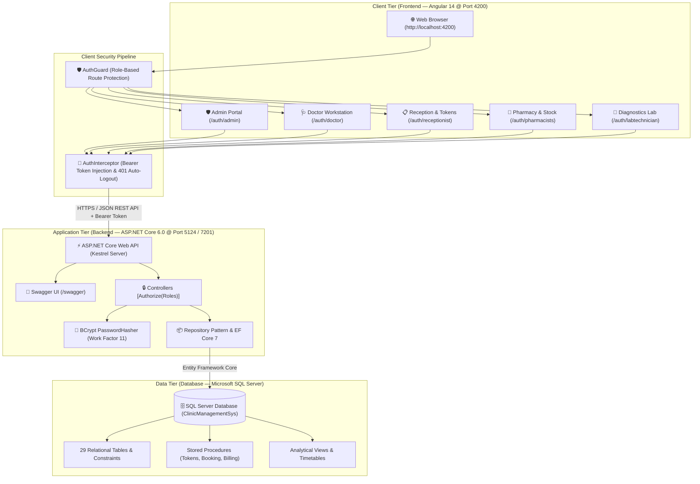

# 🏥 Enterprise Clinic Management System (CMS)

[](https://dotnet.microsoft.com/)
[](https://angular.io/)
[](https://www.microsoft.com/sql-server)
[](https://github.com/BcryptNet/bcrypt.net)
[](https://jwt.io/)
[](https://getbootstrap.com/)
[](#-system-architecture-topology)
[](#-verification--build-status)
[](LICENSE)

An end-to-end, full-stack, enterprise-grade **Clinic Management System (CMS)** architected as a clean 3-tier solution: an **Angular 14 SPA** frontend, an **ASP.NET Core 6.0 Web API** backend, and a relational **Microsoft SQL Server** database. The system delivers complete clinical and administrative workflows including appointment scheduling, token generation, doctor consultations, e-prescriptions, pharmacy dispensing, laboratory diagnostics, and financial billing.

---

## 🏛️ System Architecture Topology



---

## 🌟 Tech Stack

| Layer | Technologies & Libraries | Highlights |
| :--- | :--- | :--- |
| **Backend API** | ASP.NET Core 6.0 Web API, C# 10 | Clean controller-repository pattern, Dependency Injection, Swagger OpenAPI documentation |
| **Data Access** | Entity Framework Core 7, Microsoft SQL Server Provider | Code-first and Database-first models, LINQ queries, cycle-safe JSON serialization |
| **Security & Auth** | BCrypt.Net-Next (v4.0.3), JWT Bearer Authentication | Work factor 11 salted hashing, automatic legacy migration, HMAC-SHA256 signed tokens with rich claims |
| **Frontend Client** | Angular 14, TypeScript 4.7, RxJS 7 | Modular feature architecture, lazy routing, HTTP Interceptors, Route Guards, reactive state |
| **UI Design System** | Bootstrap 5, Font Awesome 4.7, SCSS | Modern medical clinic theme, responsive tables, modal dialogs, toast notifications (`ngx-toastr`) |
| **Database** | Microsoft SQL Server (2019 / 2022 / Azure SQL) | 29 relational tables, stored procedures, audit timestamps, analytical views and functions |
| **Cloud Deployment** | Render.com, Vercel, Netlify, Azure SQL / Supabase | 100% free-of-cost cloud tier hosting architecture |

---

## 🏥 Enterprise Clinical & Administrative Modules

```
                        ┌────────────────────────────────────────────────────────┐
                        │      Clinic Management System (CMS) Modules            │
                        └───────────────────┬────────────────────────────────────┘
          ┌─────────────────┬───────────────┼───────────────┬──────────────────┐
          ▼                 ▼               ▼               ▼                  ▼
   🩺 Doctor Desk    📋 Reception    💊 Pharmacy     🔬 Lab Tests      🛡️ Administration
   • Consultations   • Registration  • Drug Catalog  • Test Orders     • Staff Directory
   • e-Prescriptions • Walk-in Token • Stock Control • Specimen Queue  • Doctor Schedules
   • Lab Test Orders • Doctor Appts  • Dispensation  • Test Results    • User Credentials
   • Medical History • Visit Billing • Rx Invoicing  • Lab Reports     • Role Governance
```

### 1. 🩺 Doctor Workstation & Clinical Consultation
* **Patient Queue & Timetable:** Doctors view their daily patient queue and scheduled appointments in real time.
* **Consultation History:** Instant access to patient medical background, prior visits, and diagnoses.
* **e-Prescribing (e-Rx):** Direct entry of prescribed medications with dosage, frequency, and duration.
* **Diagnostics Ordering:** Request laboratory tests and view pathology reports directly in the consultation screen.

### 2. 📋 Reception Desk, Triage & Token Flow
* **Patient Registration:** Fast intake of patient demographics, contact details, and emergency contacts.
* **Daily Token Issuance:** Automated token generation with doctor queue sequencing and department routing.
* **Doctor Appointment Booking:** Calendar-based slot scheduling aligned with doctor timetables.
* **Consultation Billing:** Immediate generation and payment recording for doctor consultation fees.

### 3. 💊 Central Pharmacy Dispensary & Drug Inventory
* **Medication Master Catalog:** Comprehensive database of generic and branded pharmaceuticals with unit pricing.
* **Stock & Reorder Monitoring:** Inventory tracking with automatic warnings for low stock levels.
* **Prescription Fulfillment:** Pharmacists view doctor e-prescriptions and dispense prescribed quantities.
* **Pharmacy Billing:** Itemized invoice generation with automated inventory stock deduction.

### 4. 🔬 Diagnostics Laboratory & Pathology Reports
* **Laboratory Test Catalog:** Standardized test directory (Blood, Urine, Biochemistry, Imaging) with normal reference ranges.
* **Specimen Queue:** Order tracking from sample collection to technician processing.
* **Diagnostic Report Generation:** Direct entry of patient test results with doctor access.
* **Lab Billing:** Invoicing for diagnostic procedures with receipt generation.

### 5. 🛡️ Clinic Administration & Staff Governance
* **Staff Directory:** Comprehensive management of doctors, nurses, receptionists, pharmacists, and technicians.
* **Doctor Practice Schedules:** Timetable configuration, specializations, consulting rooms, and fees.
* **Role-Based Access Control (RBAC):** Fine-grained permission assignments across 5 distinct system roles.
* **User Credential Governance:** Secure credential creation, status activation/deactivation, and password auditing.

### 6. 💳 Master Billing & Financial Accounts
* **Itemized Billing:** Tracking consultation fees, pharmacy medications, and diagnostic laboratory charges.
* **Invoice Generation:** Printable patient bills with tax calculation and itemized breakdowns.
* **Payment Tracking:** Multi-tender recording (Cash, Card, UPI) with audit timestamps.

---

## 📁 Repository Structure

```
d:\Clinic Management System\
├── 📂 Backend/                        # ASP.NET Core 6.0 Web API & EF Core Solution
│   ├── ClinicManagementSys-Soln.sln   # Visual Studio Solution File (Flattened)
│   ├── 📂 ClinicManagementSys/        # Core C# Web API Project
│   │   ├── 📂 Controllers/            # REST API endpoints (Protected by [Authorize])
│   │   ├── 📂 Model/                  # Entity Framework Core database entities (29 tables)
│   │   ├── 📂 Repository/             # Repository pattern business logic & BCrypt hasher
│   │   ├── 📂 ViewModel/              # Request/Response DTOs (LoginDto, AuthResponseDto)
│   │   ├── Program.cs                 # App bootstrap, DI container, JWT & Swagger setup
│   │   ├── appsettings.json           # Database connection string & API configurations
│   │   └── ClinicManagementSys.csproj # Project dependencies & package references
│   ├── ARCHITECTURE.md                # Backend architecture reference
│   ├── BACKEND_ARCHITECTURE.md        # Technical API endpoints & schema design
│   └── README.md                      # Backend setup and developer guide
│
├── 📂 Frontend/                       # Angular 14 Multi-Role SPA Client
│   ├── 📂 src/                        # Clean source code (Components, Services, Models)
│   │   ├── 📂 app/
│   │   │   ├── 📂 admin/              # Administrator portal
│   │   │   ├── 📂 auth/               # Login, JWT state, Role Dashboards, Navbar
│   │   │   ├── 📂 doctor/             # Consultation, diagnosis, prescription flows
│   │   │   ├── 📂 doctormgmt/         # Doctor schedule, specializations, consulting fees
│   │   │   ├── 📂 lab/ & labtechnicians/ # Lab tests, specimen analysis, test reports
│   │   │   ├── 📂 medicine-managements/  # Central pharmacy inventory & reorder alerts
│   │   │   ├── 📂 pharmacists/        # Medicine distribution & pharmacy billing
│   │   │   ├── 📂 receptionists/      # Patient registrations, appointment scheduling, billing
│   │   │   ├── 📂 shared/             # Singleton HTTP services, models, AuthInterceptor, AuthGuard
│   │   │   └── 📂 uregistration/      # System user credentials management
│   │   ├── 📂 assets/                 # Icons, images, external styles
│   │   ├── 📂 environments/           # Central backend API base URL (https://localhost:7201/api/)
│   │   ├── index.html                 # App shell HTML with Bootstrap 5 & Font Awesome
│   │   └── styles.scss                # Global design system & enterprise theme
│   ├── angular.json                   # Angular CLI build configurations
│   ├── package.json                   # NPM dependencies (Bootstrap 5, Toastr, NgxPagination)
│   ├── FRONTEND_ARCHITECTURE_AND_WORKFLOW.md # Comprehensive UI workflow specification
│   └── README.md                      # Frontend setup and developer guide
│
├── 📂 Database/                       # SQL Server Relational Database Scripts
│   ├── 00_MASTER_CMS_DATABASE.sql     # ⚡ Master all-in-one setup script (29 tables + seed data)
│   ├── 01_CREATE_DATABASE_AND_TABLES.sql # Schema DDL (Tables, Foreign Keys, Indexes)
│   ├── 02_INSERT_SEED_DATA.sql        # Baseline seed data (Roles, Staff, Doctors, Users)
│   ├── 03_STORED_PROCEDURES.sql       # Business stored procedures (Tokens, Appointments, Billing)
│   ├── 04_VIEWS_AND_FUNCTIONS.sql     # Analytical views & reporting queries
│   ├── 05_ALTER_PASSWORD_TO_HASH.sql  # Database migration for BCrypt hash storage
│   └── README.md                      # Database documentation & ER schema breakdown
│
├── 📂 .vscode/                        # IDE Multi-Project Launch & Task Configs
│   ├── launch.json                    # Single-click run & debug for Backend + Frontend
│   └── tasks.json                     # Automated tasks for dotnet run and ng serve
│
├── start_frontend.bat                 # Standalone 1-click frontend dev server launcher
├── start_backend.bat                  # Standalone 1-click backend API launcher
├── ENTERPRISE_UPGRADE_REPORT.md       # Master 9-section transformation & security audit report
└── README.md                          # Master Unified Architecture Documentation (This file)
```

---

## 🚀 Pre-Configured Demo Credentials

The database comes pre-seeded with all 5 clinical and operational roles:

| Role | Username | Password | Default Portal Route | Description & Permissions |
| :--- | :--- | :--- | :--- | :--- |
| **Administrator** | `thanya` | `10041` | `/auth/admin` | Full clinic governance: staff directory, doctor management, department assignments, user logins |
| **Administrator (Alt)** | `james` | `james123` | `/auth/admin` | Secondary clinic administrative profile with full RBAC access |
| **Doctor** | `thomas` | `thomas123` | `/auth/doctor` | Clinical workstation: appointment consultations, diagnosis recording, e-prescriptions, lab ordering |
| **Doctor (Alternative)** | `varsha` | `111` | `/auth/doctor` | Secondary doctor profile with active schedule timetable |
| **Receptionist** | `ahal` | `111` | `/auth/receptionist` | Front desk operations: patient registration, appointment booking, token issuance, consultation billing |
| **Pharmacist** | `tharak` | `111` | `/auth/pharmacists` | Pharmacy dispensary: drug catalog, stock inventory, prescription fulfillment, pharmacy billing |
| **Lab Technician** | `karthika` | `111` | `/auth/labtechnician` | Diagnostics laboratory: test requests, specimen entry, diagnostic report generation, lab billing |

> **🔐 Transparent BCrypt Auto-Migration:** On each account's first login, the system automatically checks whether the stored password is an encrypted hash. If it is legacy plaintext, it securely computes a salted 60-character **BCrypt hash** (`$2a$11$...`), transparently saves it to the database, and issues an HMAC-SHA256 JWT Bearer token.

---

## 🌐 Core REST API Endpoints Catalog

All secured endpoints require the HTTP header: `Authorization: Bearer <JWT_TOKEN>`

| HTTP Method | API Route | Access Role | Description |
| :--- | :--- | :--- | :--- |
| `POST` | `/api/Logins/login` | *Public* | Authenticates credentials and returns JWT Bearer token with rich claims |
| `GET` | `/api/Doctors` | `Doctor`, `Admin` | Retrieves all registered doctors with specializations and fees |
| `GET` | `/api/Doctors/{id}` | `Doctor`, `Admin` | Retrieves specific doctor profile and consultation timetable |
| `GET` | `/api/Staffs` | `Admin` | Lists all clinic staff members across all departments |
| `POST` | `/api/Staffs` | `Admin` | Registers a new clinic employee |
| `GET` | `/api/Receptions/patients` | `Receptionist`, `Admin` | Retrieves patient registry and demographic records |
| `POST` | `/api/Receptions/appointments` | `Receptionist` | Schedules a new patient appointment with an active doctor |
| `POST` | `/api/Receptions/tokens` | `Receptionist` | Generates a daily sequential walk-in consultation token |
| `GET` | `/api/Pharmacists/medicines` | `Pharmacist`, `Doctor` | Queries pharmaceutical catalog and inventory stock levels |
| `POST` | `/api/Pharmacists/bill` | `Pharmacist` | Generates a pharmacy bill and deducts inventory quantities |
| `GET` | `/api/Labs/tests` | `LabTechnician`, `Doctor` | Retrieves diagnostic laboratory test requests |
| `POST` | `/api/Labs/reports` | `LabTechnician` | Uploads and records specimen diagnostic test results |

---

## 💻 Running Locally

### Option A: 1-Click Startup (Windows Desktop)
Double-click the pre-configured launcher scripts in the workspace root:
* [`start_backend.bat`](./start_backend.bat) — Boots the ASP.NET Core API server on ports `5124` & `7201`.
* [`start_frontend.bat`](./start_frontend.bat) — Boots the Angular development server on port `4200`.

---

### Option B: Step-by-Step Manual Setup

#### Step 1: Database Setup (`Database`)
**Requirements:** Microsoft SQL Server Express (or LocalDB / Azure SQL).
1. Open PowerShell in the project root:
```powershell
sqlcmd -S ".\SQLEXPRESS" -E -i "Database\00_MASTER_CMS_DATABASE.sql"
```
2. Verify connection string in `Backend/ClinicManagementSys/appsettings.json`:
```json
"ConnectionStrings": {
  "PropelAAug24Connection": "Data Source=.\\SQLEXPRESS;Initial Catalog=ClinicManagementSys;Integrated Security=True;Trusted_Connection=True;TrustServerCertificate=True"
}
```

#### Step 2: Backend API (`Backend`)
**Requirements:** .NET 6.0 SDK (or higher).
```powershell
cd Backend
dotnet build
dotnet run --project ClinicManagementSys/ClinicManagementSys.csproj --urls="http://localhost:5124;https://localhost:7201"
```
* **Swagger Interactive Documentation:** [http://localhost:5124/swagger](http://localhost:5124/swagger)
* **HTTPS API Endpoint:** `https://localhost:7201`
* **HTTP API Endpoint:** `http://localhost:5124`

#### Step 3: Frontend Client (`Frontend`)
**Requirements:** Node.js 16+ or 18+ and npm.
```bash
cd Frontend
npm install
npm start
```
* Open your browser at: **[http://localhost:4200](http://localhost:4200/)**

---

## ☁️ 100% Free Live Cloud Deployment Guide

This enterprise application can be hosted entirely on **100% free-tier** cloud services:

```
                  ┌──────────────────────────────────────────────┐
                  │          Free-Tier Cloud Architecture        │
                  └──────────────────────┬───────────────────────┘
                                         │
        ┌────────────────────────────────┼────────────────────────────────┐
        ▼                                ▼                                ▼
  🗄️ Database                    ⚡ Backend API                   🌐 Frontend SPA
  Azure SQL / Supabase           Render.com Web Service           Vercel / Netlify
  • 32GB Free Tier               • Free Docker / .NET Service     • Free Static & SPA Hosting
  • Relational Schema            • Auto GitHub CI/CD              • Global Edge CDN
```

### Step 1: Database (Azure SQL Free Tier / Supabase PostgreSQL / Neon)
1. **Azure SQL (Free Tier):**
   * Create a free Azure SQL database (32GB free storage).
   * Run the master script `Database/00_MASTER_CMS_DATABASE.sql` using Azure Data Studio or SSMS.
   * Copy the connection string into your production configuration.
2. **Managed PostgreSQL (Supabase Free Tier at [supabase.com](https://supabase.com/)):**
   * Switch EF Core provider in `ClinicManagementSys.csproj` to `Npgsql.EntityFrameworkCore.PostgreSQL`.

---

### Step 2: Backend Deployment (Render.com - 100% Free Web Service)
1. Push this repository to your GitHub account:
```powershell
git add .
git commit -m "feat: enterprise clinic management system architecture and security"
git push origin main
```
2. Log into [render.com](https://render.com/) (free account).
3. Click **New +** -> **Web Service** -> Link your GitHub repository.
4. Set the following settings:
   * **Root Directory:** `Backend/ClinicManagementSys`
   * **Environment / Runtime:** `.NET` (or `Docker`)
   * **Build Command:** `dotnet publish -c Release -o out`
   * **Start Command:** `dotnet out/ClinicManagementSys.dll --urls http://0.0.0.0:$PORT`
   * **Plan:** Free
5. In **Environment Variables**, add:
   * `ConnectionStrings__PropelAAug24Connection`: *(Your production database connection string)*
   * `Jwt__Key`: `ThisIsASecretKeyWithAtleast32Characters!`
   * `Jwt__Issuer`: `faith.com`
   * `ASPNETCORE_ENVIRONMENT`: `Production`
6. Click **Create Web Service**. Render will build and deploy the API (e.g., `https://your-cms-api.onrender.com`).

---

### Step 3: Frontend Deployment (Vercel / Netlify - 100% Free Static Hosting)

#### Option A: Vercel (Recommended)
1. In `Frontend/src/environments/environment.prod.ts`, update `apiUrl`:
```typescript
export const environment = {
  production: true,
  apiUrl: 'https://your-cms-api.onrender.com/api/'
};
```
2. Log into [vercel.com](https://vercel.com/) and click **Add New Project** -> Import repository.
3. Configure project settings:
   * **Root Directory:** `Frontend`
   * **Framework Preset:** `Angular`
   * **Build Command:** `npm run build`
   * **Output Directory:** `dist/clinic-management-sys`
4. Click **Deploy**. Vercel serves the Angular SPA with single-page app routing enabled.

#### Option B: Netlify
1. Log into [netlify.com](https://netlify.com/) -> **Add new site** -> Import from Git.
2. Settings:
   * **Base directory:** `Frontend`
   * **Build command:** `npm run build`
   * **Publish directory:** `Frontend/dist/clinic-management-sys`
3. Click **Deploy Site**. Netlify automatically enables SPA routing.

---

## 🔒 Security & Enterprise Architecture Features

* **BCrypt Password Cryptography:** Passwords stored with cryptographic salt and work factor 11 (`BCrypt.Net-Next`), with automatic transparent migration of legacy accounts.
* **Encrypted POST Login Pipeline:** Credentials sent via JSON body to `POST /api/Logins/login`, eliminating URL parameter leakage and query logging vulnerabilities.
* **HMAC-SHA256 JWT Authentication with Rich Claims:** Tokens embedded with `NameIdentifier`, `Name`, `Role`, `RoleId`, `DoctorId`, `StaffId`, and unique GUID `Jti`.
* **Automated Angular HTTP Interceptor (`AuthInterceptor`):** Client-side pipeline automatically injects `Authorization: Bearer <token>` on all backend calls and gracefully handles 401/403 session expirations with automatic logout.
* **Role-Based Route Guards (`AuthGuard`):** Angular `CanActivate` guards strictly restrict access to designated role portals.
* **Controller Enforcement:** Backend controllers (`Doctors`, `Staffs`, `Receptions`, `Pharmacists`, `Labs`) protected by `[Authorize]`.
* **Relational Data Integrity:** 29 SQL Server tables enforcing primary keys, foreign key constraints, unique indexes, and audit timestamps.
* **Clean 3-Tier Architecture:** Monorepo with flattened solution hierarchy, zero redundant wrappers, and compound 1-click multi-project debugging.

---

## 🧪 Verification & Build Status

| Component | Verification Command | Status | Notes |
| :--- | :--- | :--- | :--- |
| **Backend API** | `dotnet build` | ✅ Passing | 0 Errors, 0 Warnings on .NET 6.0 |
| **Frontend Client** | `npm run build` | ✅ Passing | Angular 14 production bundle built successfully |
| **Database Migrations** | `sqlcmd -i Database\00_MASTER_CMS_DATABASE.sql` | ✅ Passing | 29 Tables, seed data, and stored procedures verified |
| **BCrypt Authentication** | `POST /api/Logins/login` | ✅ Verified | Automatic BCrypt hashing & JWT claims generation verified |

---

## 📖 In-Depth Subsystem Documentation Hub

* 👉 **[Enterprise Upgrade & Security Report](file:///d:/Clinic%20Management%20System/ENTERPRISE_UPGRADE_REPORT.md)** — Comprehensive 9-section master report documenting all security audits, architecture flattening, and test logs.
* 👉 **[Backend Architecture & API Specification](file:///d:/Clinic%20Management%20System/Backend/BACKEND_ARCHITECTURE.md)** — Entity-Relationship design, controller catalog, and database domain mapping.
* 👉 **[Frontend Architecture & Workflow Specification](file:///d:/Clinic%20Management%20System/Frontend/FRONTEND_ARCHITECTURE_AND_WORKFLOW.md)** — Complete 12-module inventory, lazy-loaded route hierarchy, and UI state flow.
* 👉 **[Database Schema & DDL Catalog](file:///d:/Clinic%20Management%20System/Database/README.md)** — Table schemas, stored procedures catalog, and analytical views breakdown.
